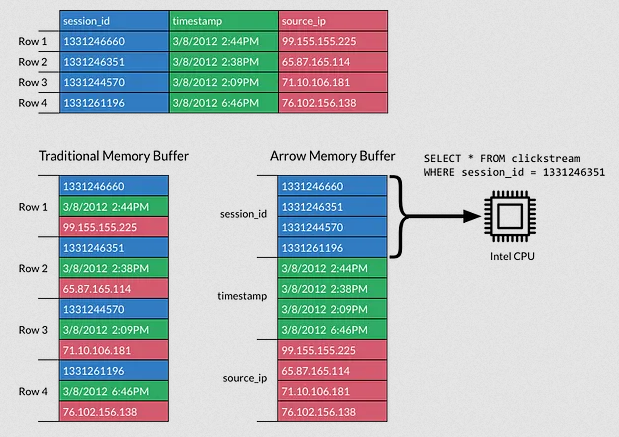

# Polars : a blazingly fast dataframe library
Two languages have made a big impression on the lasts stackoverflow's most loved survey: the rapidly rising **Elixir** and the dominating **Rust**. As the first one is developping as a python-like functionnal language for resilient and highly concurrent systems, the second is getting a lot of traction in type safe, fast and reliable systems.

When the functionnal pythonic Elixir got it's own NumPy (multi-dimensional arrays), it chose the shiny rust based framework for it's backend : Polars.
But don't worry, they have a [Python package](https://pypi.org/project/polars/) for Pandas users.


# Why
To follow the trend of rewriting [everything](https://zaiste.net/posts/shell-commands-rust/) in Rust but also to adress the shortcomings of Pandas, a project born in 2011 that didn't envision the scale of the data needs in 2023 by the words of it's own [author](https://wesmckinney.com/blog/apache-arrow-pandas-internals/). So just as Pandas, it offers tools to read and write data in various formats with it's fast parsers, including a highly performant [Apache Parquet](https://parquet.apache.org/) reader. Most of it's difference with Pandas are what makes its strength.


## Apache Arrow
Apache  is a columnar in-memory format designed for efficiency in analytics operations on our modern computation units (both CPUs and GPUs). It also allow zero-copy data-access to manipulate large datasets at maximum speed.


Columnar databases store multiples row's column values together for a more efficient data access even on large sources. It also allows to load only the relevant data in memory.

##  Lazy and Eager API
Polars offer two types of API, an Eager one that evaluate the code as soon as it's run (Pandas style) and a Lazy that generates a query plan that will be optimized before running.

The difference ? You start an eager query with `read_*` and a lazy one with `scan_*`. The `*` can be replaced with any valid file type and in both case, the query end with a `.collect()` to capture the result and save it in a variable. Without collection, only the query plan will be displayed.

## Query optimization and parallelization
Lazy query evaluation will looks for way to run the query the fastest way and reduce the memory usage. Some of its strategies to reach this goal are :
- the execution of some operations at scan level : aggregate and projection
- simplification of expressions
- parallel execution at the physical plan
The last strategy on the parallelization is actually a crucial step to leverage the true potential of our multi-core processing units. The data is split into chunk and processed in multiple threads allowing a larger amount of data to be processed in the same time. Both Pandas and Python lack the ability to multithread as easily.

## Memory manaagement
Polars also allow to load larger data that doesn't fir into memory with it's streaming capabilities. A simple `collect(streaming=True)` is enough to run the slower but still fast streaming query.

# Installation
The python package for polars gets installed like any other. I prefer for my experimentations to [create a python virtual environment](https://docs.python.org/3/library/venv.html) first instead of install them globally (but this step is optional). For that, you need to run these commands in your project folder (you can refer to the documentation if the `source` activate line doesn't work because you're using a windows shell):
```python
python3 -m venv venv_folder  # create a virtual environment folder containing a python interpreter and packages

# activate the virtual environment making the new interpreter and its path the default for your terminal
source venv_folder/bin/activate # for UNIX systems
## OR
# source venv_folder/Script/activate # for Windows Systems
```

The virtual environment created and activated, you can install your package with python classic package installer.
```python
pip install polars
```
There also are [optionnal dependancies](https://pypi.org/project/polars/) you can install polars with.
```python
pip install polars[all] # install all dependancies
pip install polars[pandas, numpy, timezone] # install subset of optionnal dependancies
```

# Series, Dataframes & Lazyframes
Polars offers 3 types of data structures, 2 common and an extra one.
* `Series` are one dimension arrays able to store multiple types of values. Just as Pandas or Numpy. They can be created with a list or a tuple where the key will be a string that label it.
```python
s = pl.Series("a", [1, 2, 3])
s
```
    shape: (3,)
    Series: 'a' [i64]
    [
            1
            2
            3
    ]

* `Dataframes` are two dimension tables (with both lines and columns). Each column have a single type and is independant from others types. They can be created from `dicts` or a list of typed Series for example. They are also created on the execution of the `.read_*` method where `*` represent a supported file type.
```python
data = {"a": [1, 2], "b": [3, 4]}
df = pl.DataFrame(data)
df
```
    shape: (2, 2)
    ┌─────┬─────┐
    │ a   ┆ b   │
    │ --- ┆ --- │
    │ i64 ┆ i64 │
    ╞═════╪═════╡
    │ 1   ┆ 3   │
    │ 2   ┆ 4   │
    └─────┴─────┘

* `Lazyframes` are a representation of a Lazy query against a Dataframe. It's the data structure allowing query optimisation and parallelization that makes the strength of Polars. They are created from the `.lazy` method on a dataframe or a `.scan_*` method where `*` represent a supported file type.
```python
data = {"a": [1, 2], "b": [3, 4]}
ldf = pl.LazyFrame(data)
print(ldf)
```
    naive plan: (run LazyFrame.explain(optimized=True) to see the optimized plan)

    DF ["a", "b"]; PROJECT */2 COLUMNS; SELECTION: "None"

# Syntaxic snack
Here we'll see some Polars-y ways to manipulate our dataframes. Quick reminder :
> If your Polars code looks like it could be Pandas code, it might run, but it likely runs slower than it should.
## Selecting data
Polars doesn't have index so it cannot locate precise cells of the dateframe. It is strongly advised to use the expression API to select a specific column based on it's label. 
```python
df.select(["label_one"])
```
Row selection is preferred to be based on their value using the `.filter` method.
```python
df.filter(pl.col("col_label") < 10)
```
These operation can be optimized and parallelized by Polars.

## Accept the laziness
Always prefer a lazy evaluation of the query either implicitly by using the `scan_csv` function or explicitly by using the `lazy` function.
```python
df = pl.scan_csv(csv_file)
grouped_df = df.groupby('id1').agg(pl.col('v1').sum()).collect()
```

## Column manipulation
### Assignement
We use the `.with_columns` method to recompute a value based on other columns and label the result with the `.alias` method.
```python
df.with_columns([
    (round((pl.col("ratio")*100),2)).alias("percentage"),
    (pl.col("distance_meter") * 1000).alias("distance_mm"),
])
```
### Conditional assignment
Three methods are used to specify conditions of calculation : `.when`, `.then` and `.otherwise`. These pure methods do not modify the original dataframe and allow to parallelize the evaluation of all the branches.
```python
df.with_columns(
    pl.when(pl.col("hapiness") < 6)
    .then(pl.col("sweet_beverage"))
    .otherwise(pl.col("sour_beverage")).alias("beverage_choice")
)
```

### Filtering
Just pass a boolean expression to the `.filter` method on specified columns. The query optimizer can combine them in a single optimized plan
```python
df.filter(
    (pl.col("m2_living") > 2500) & (pl.col("price") < 300000)
)
```

### Deleting a column
It is as simple as calling the `.drop` method on either a Dataframe or a Lazyframe.
```python
df = pl.DataFrame(
    {
        "foo": [1, 2, 3],
        "bar": [6.0, 7.0, 8.0],
        "ham": ["a", "b", "c"],
    }
)
df.drop("ham")
```
    shape: (3, 2)
    ┌─────┬─────┐
    │ foo ┆ bar │
    │ --- ┆ --- │
    │ i64 ┆ f64 │
    ╞═════╪═════╡
    │ 1   ┆ 6.0 │
    │ 2   ┆ 7.0 │
    │ 3   ┆ 8.0 │
    └─────┴─────┘
# Missing data
For Polars, missing data is only represented as `null` value. An exception made for float column where `NaN` values are permited but only as a special floating point value.
There are three ways to ensure your missing data are represented in your dataframe.
- Use the `null_values` parameter to provide a string, a list of strings or a dictionnary of column label and associated null values.
    ```python
    pl.read_csv("data.csv",
            null_values="NULL",
            # infer_schema_length=0,  # optional (if you get a parsing error)
            )
    ```
- Perform a conditionnal assignment to detect the sentinel values. It's good to know that the `.otherwise` method defaults to `null`
    ```python
    df.with_columns(
        pl.when(pl.col(pl.Utf8) != "NULL") # detect NULL string in Utf8 typed columns
            .then(pl.col(pl.Utf8)) # keep original value if not null value. Otherwise is None by default
            .keep_name() # keep the name of the column
    )
    ```

# Practical example
To practice using this library, we'll use a dataset scrapped from the imdb website. We'll work the polars way with the Lazy API.

We'll obviously start by importing library and loading the CSV file
```python
import polars as pl
lf = pl.scan_csv("imdb_votes_2017.csv")
```
To get an idea of the data we have to work with, we'll display the first lines of the computed Lazyframe using the `.fetch` method instead of `.collect`. It allows us to specify the number of rows we want to preview for a quick debug process, and really shines on large datasets.
```python
lf.fetch(5) # use fetch instead of collect to get a dataframe to not run query on whole data
```
    shape: (5, 10)
    ┌────────────┬────────────┬───────────┬────────────┬─────┬──────────┬──────┬────────────┬───────────┐
    │ web-scrape ┆ web-scrape ┆ films_ite ┆ films_item ┆ ... ┆ Realisat ┆ Note ┆ Number_of_ ┆ Metascore │
    │ r-order    ┆ r-start-ur ┆ ms        ┆ s-href     ┆     ┆ or       ┆ ---  ┆ views      ┆ ---       │
    │ ---        ┆ l          ┆ ---       ┆ ---        ┆     ┆ ---      ┆ f64  ┆ ---        ┆ str       │
    │ str        ┆ ---        ┆ str       ┆ str        ┆     ┆ str      ┆      ┆ str        ┆           │
    │            ┆ str        ┆           ┆            ┆     ┆          ┆      ┆            ┆           │
    ╞════════════╪════════════╪═══════════╪════════════╪═════╪══════════╪══════╪════════════╪═══════════╡
    │ 1676580318 ┆ https://ww ┆ Shot      ┆ https://ww ┆ ... ┆ Ric      ┆ 7.3  ┆ 89K        ┆ 59        │
    │ -51        ┆ w.imdb.com ┆ Caller    ┆ w.imdb.com ┆     ┆ Roman    ┆      ┆            ┆           │
    │            ┆ /search/ti ┆           ┆ /title/tt4 ┆     ┆ Waugh    ┆      ┆            ┆           │
    │            ┆ tl...      ┆           ┆ 63...      ┆     ┆          ┆      ┆            ┆           │
    │ 1676580320 ┆ https://ww ┆ The       ┆ https://ww ┆ ... ┆ Seth Mac ┆ 8.0  ┆ 90K        ┆ null      │
    │ -52        ┆ w.imdb.com ┆ Orville   ┆ w.imdb.com ┆     ┆ Farlane  ┆      ┆            ┆           │
    │            ┆ /search/ti ┆           ┆ /title/tt5 ┆     ┆          ┆      ┆            ┆           │
    │            ┆ tl...      ┆           ┆ 69...      ┆     ┆          ┆      ┆            ┆           │
    │ 1676580323 ┆ https://ww ┆ The       ┆ https://ww ┆ ... ┆ Matt     ┆ 9.7  ┆ 90K        ┆ null      │
    │ -53        ┆ w.imdb.com ┆ Spoils of ┆ w.imdb.com ┆     ┆ Shakman  ┆      ┆            ┆           │
    │            ┆ /search/ti ┆ War       ┆ /title/tt5 ┆     ┆          ┆      ┆            ┆           │
    │            ┆ tl...      ┆           ┆ 77...      ┆     ┆          ┆      ┆            ┆           │
    │ 1676580325 ┆ https://ww ┆ Game of   ┆ https://ww ┆ ... ┆ David    ┆ 9.2  ┆ 2.1M       ┆ null      │
    │ -54        ┆ w.imdb.com ┆ Thrones   ┆ w.imdb.com ┆     ┆ Benioff  ┆      ┆            ┆           │
    │            ┆ /search/ti ┆           ┆ /title/tt0 ┆     ┆          ┆      ┆            ┆           │
    │            ┆ tl...      ┆           ┆ 94...      ┆     ┆          ┆      ┆            ┆           │
    │ 1676580327 ┆ https://ww ┆ Atypical  ┆ https://ww ┆ ... ┆ Robia    ┆ 8.2  ┆ 92K        ┆ null      │
    │ -55        ┆ w.imdb.com ┆           ┆ w.imdb.com ┆     ┆ Rashid   ┆      ┆            ┆           │
    │            ┆ /search/ti ┆           ┆ /title/tt6 ┆     ┆          ┆      ┆            ┆           │
    │            ┆ tl...      ┆           ┆ 31...      ┆     ┆          ┆      ┆            ┆           │
    └────────────┴────────────┴───────────┴────────────┴─────┴──────────┴──────┴────────────┴───────────┘
We can see the firsts columns don't present really relevent data. We can get all the headers using by running the following line:
```python
lf.columns
```
    ['web-scraper-order', 'web-scraper-start-url','films_items','films_items-href','Film_Title','Year','Realisator','Note','Number_of_views','Metascore']
It confirms the first four columns aren't relevant data on our movies.  They can be easily ignored using the `.drop` method as stated earlier?
```python
lf = lf.drop("web-scraper-order", "web-scraper-start-url", "films_items", "films_items-href")
lf.fetch(5)
```
    shape: (5, 6)
    ┌───────────────────┬──────┬─────────────────┬──────┬─────────────────┬───────────┐
    │ Film_Title        ┆ Year ┆ Realisator      ┆ Note ┆ Number_of_views ┆ Metascore │
    │ ---               ┆ ---  ┆ ---             ┆ ---  ┆ ---             ┆ ---       │
    │ str               ┆ str  ┆ str             ┆ f64  ┆ str             ┆ str       │
    ╞═══════════════════╪══════╪═════════════════╪══════╪═════════════════╪═══════════╡
    │ Shot Caller       ┆ 2017 ┆ Ric Roman Waugh ┆ 7.3  ┆ 89K             ┆ 59        │
    │ The Orville       ┆ null ┆ Seth MacFarlane ┆ 8.0  ┆ 90K             ┆ null      │
    │ The Spoils of War ┆ null ┆ Matt Shakman    ┆ 9.7  ┆ 90K             ┆ null      │
    │ Game of Thrones   ┆ null ┆ David Benioff   ┆ 9.2  ┆ 2.1M            ┆ null      │
    │ Atypical          ┆ null ┆ Robia Rashid    ┆ 8.2  ┆ 92K             ┆ null      │
    └───────────────────┴──────┴─────────────────┴──────┴─────────────────┴───────────┘
We'll always store our Lazyframe in the `lf` variable wull use the `.fetch` method to preview our result's. This preview show quite some `null` values in our frame. But being from a CSV file, we don't know if they are real missing value or `"null"`
strings. A quick check on the matter can look something like this, selecting only the two suspicious columns we'll want to convert to more adequate types. if null strings are mixed with null values in the lazyframe
```python
lf.select(["Year", "Metascore"]).filter(pl.col("Year") == "null").fetch(5)
```
    shape: (5, 2)
    ┌──────┬───────────┐
    │ Year ┆ Metascore │
    │ ---  ┆ ---       │
    │ str  ┆ str       │
    ╞══════╪═══════════╡
    │ null ┆ null      │
    │ null ┆ null      │
    │ null ┆ null      │
    │ null ┆ null      │
    │ null ┆ null      │
    └──────┴───────────┘
There are some null strings in both of them that could throw errors strict on conversion. The `.cast` method used for it have a `strict` boolean attribute that allow us to ignore such errors and replace the problematic values by `null` but for the sake of the example, we'll modify them manually using this simple algorithm. It's good to know that `.otherwise` defaults to `null`, which is why I only specified the happy path.
```python
lf.with_columns(
    pl.when(pl.col(pl.Utf8) != "null")
    .then(pl.col(pl.Utf8))
    .keep_name()
    )
lf.fetch(10)
```
    shape: (10, 10)
    ┌────────────┬────────────┬───────────┬────────────┬─────┬──────────┬──────┬────────────┬───────────┐
    │ web-scrape ┆ web-scrape ┆ films_ite ┆ films_item ┆ ... ┆ Realisat ┆ Note ┆ Number_of_ ┆ Metascore │
    │ r-order    ┆ r-start-ur ┆ ms        ┆ s-href     ┆     ┆ or       ┆ ---  ┆ views      ┆ ---       │
    │ ---        ┆ l          ┆ ---       ┆ ---        ┆     ┆ ---      ┆ f64  ┆ ---        ┆ str       │
    │ str        ┆ ---        ┆ str       ┆ str        ┆     ┆ str      ┆      ┆ str        ┆           │
    │            ┆ str        ┆           ┆            ┆     ┆          ┆      ┆            ┆           │
    ╞════════════╪════════════╪═══════════╪════════════╪═════╪══════════╪══════╪════════════╪═══════════╡
    │ 1676580318 ┆ https://ww ┆ Shot      ┆ https://ww ┆ ... ┆ Ric      ┆ 7.3  ┆ 89K        ┆ 59        │
    │ -51        ┆ w.imdb.com ┆ Caller    ┆ w.imdb.com ┆     ┆ Roman    ┆      ┆            ┆           │
    │            ┆ /search/ti ┆           ┆ /title/tt4 ┆     ┆ Waugh    ┆      ┆            ┆           │
    │            ┆ tl...      ┆           ┆ 63...      ┆     ┆          ┆      ┆            ┆           │
    │ 1676580320 ┆ https://ww ┆ The       ┆ https://ww ┆ ... ┆ Seth Mac ┆ 8.0  ┆ 90K        ┆ null      │
    │ -52        ┆ w.imdb.com ┆ Orville   ┆ w.imdb.com ┆     ┆ Farlane  ┆      ┆            ┆           │
    │            ┆ /search/ti ┆           ┆ /title/tt5 ┆     ┆          ┆      ┆            ┆           │
    │            ┆ tl...      ┆           ┆ 69...      ┆     ┆          ┆      ┆            ┆           │
    │ 1676580323 ┆ https://ww ┆ The       ┆ https://ww ┆ ... ┆ Matt     ┆ 9.7  ┆ 90K        ┆ null      │
    │ -53        ┆ w.imdb.com ┆ Spoils of ┆ w.imdb.com ┆     ┆ Shakman  ┆      ┆            ┆           │
    │            ┆ /search/ti ┆ War       ┆ /title/tt5 ┆     ┆          ┆      ┆            ┆           │
    │            ┆ tl...      ┆           ┆ 77...      ┆     ┆          ┆      ┆            ┆           │
    │ 1676580325 ┆ https://ww ┆ Game of   ┆ https://ww ┆ ... ┆ David    ┆ 9.2  ┆ 2.1M       ┆ null      │
    │ -54        ┆ w.imdb.com ┆ Thrones   ┆ w.imdb.com ┆     ┆ Benioff  ┆      ┆            ┆           │
    │            ┆ /search/ti ┆           ┆ /title/tt0 ┆     ┆          ┆      ┆            ┆           │
    │            ┆ tl...      ┆           ┆ 94...      ┆     ┆          ┆      ┆            ┆           │
    │ ...        ┆ ...        ┆ ...       ┆ ...        ┆ ... ┆ ...      ┆ ...  ┆ ...        ┆ ...       │
    ...
    │ 1676580338 ┆ https://ww ┆ The Babys ┆ https://ww ┆ ... ┆ McG      ┆ 6.3  ┆ 97K        ┆ null      │
    │ -60        ┆ w.imdb.com ┆ itter     ┆ w.imdb.com ┆     ┆          ┆      ┆            ┆           │
    │            ┆ /search/ti ┆           ┆ /title/tt4 ┆     ┆          ┆      ┆            ┆           │
    │            ┆ tl...      ┆           ┆ 22...      ┆     ┆          ┆      ┆            ┆           │
    └────────────┴────────────┴───────────┴────────────┴─────┴──────────┴──────┴────────────┴───────────┘
We can now safely change our columns type to numerical ones, leaving the `strict` attribute default to one and we get no errors.
```python
lf = lf.with_columns([
    pl.col("Year").cast(pl.UInt16).keep_name(),
    pl.col("Note").cast(pl.Float32).keep_name(),
    pl.col("Metascore").cast(pl.UInt8).keep_name(),
    ])
lf.collect().describe()
```
    shape: (7, 7)
    ┌────────────┬────────────────┬────────┬──────────────┬──────────┬─────────────────┬───────────┐
    │ describe   ┆ Film_Title     ┆ Year   ┆ Realisator   ┆ Note     ┆ Number_of_views ┆ Metascore │
    │ ---        ┆ ---            ┆ ---    ┆ ---          ┆ ---      ┆ ---             ┆ ---       │
    │ str        ┆ str            ┆ f64    ┆ str          ┆ f64      ┆ str             ┆ f64       │
    ╞════════════╪════════════════╪════════╪══════════════╪══════════╪═════════════════╪═══════════╡
    │ count      ┆ 101            ┆ 101.0  ┆ 101          ┆ 101.0    ┆ 101             ┆ 101.0     │
    │ null_count ┆ 0              ┆ 22.0   ┆ 0            ┆ 0.0      ┆ 0               ┆ 24.0      │
    │ mean       ┆ null           ┆ 2017.0 ┆ null         ┆ 7.154456 ┆ null            ┆ 64.61039  │
    │ std        ┆ null           ┆ 0.0    ┆ null         ┆ 0.935791 ┆ null            ┆ 18.152248 │
    │ min        ┆ 13 Reasons Why ┆ 0.0    ┆ Aaron Sorkin ┆ 4.6      ┆ 104K            ┆ 21.0      │
    │ max        ┆ xXx: Return of ┆ 2017.0 ┆ Álex Pina    ┆ 9.7      ┆ 98K             ┆ 94.0      │
    │            ┆ Xander Cage    ┆        ┆              ┆          ┆                 ┆           │
    │ median     ┆ null           ┆ 2017.0 ┆ null         ┆ 7.3      ┆ null            ┆ 66.0      │
    └────────────┴────────────────┴────────┴──────────────┴──────────┴─────────────────┴───────────┘
After this successful operation, we can replace the missing values of the Year and Metascore columns with their respective mode.
```python
mod_col = ["Year", "Metascore"]
lf = lf.with_columns([
    pl.col(mod_col).fill_null(pl.col(mod_col).drop_nulls().mode()).keep_name(), 
])
lf.collect().describe()
```
    shape: (7, 7)
    ┌────────────┬────────────────┬────────┬──────────────┬──────────┬─────────────────┬───────────┐
    │ describe   ┆ Film_Title     ┆ Year   ┆ Realisator   ┆ Note     ┆ Number_of_views ┆ Metascore │
    │ ---        ┆ ---            ┆ ---    ┆ ---          ┆ ---      ┆ ---             ┆ ---       │
    │ str        ┆ str            ┆ f64    ┆ str          ┆ f64      ┆ str             ┆ f64       │
    ╞════════════╪════════════════╪════════╪══════════════╪══════════╪═════════════════╪═══════════╡
    │ count      ┆ 101            ┆ 101.0  ┆ 101          ┆ 101.0    ┆ 101             ┆ 101.0     │
    │ null_count ┆ 0              ┆ 0.0    ┆ 0            ┆ 0.0      ┆ 0               ┆ 0.0       │
    │ mean       ┆ null           ┆ 2017.0 ┆ null         ┆ 7.154456 ┆ null            ┆ 67.079208 │
    │ std        ┆ null           ┆ 0.0    ┆ null         ┆ 0.935791 ┆ null            ┆ 16.43696  │
    │ min        ┆ 13 Reasons Why ┆ 2017.0 ┆ Aaron Sorkin ┆ 4.6      ┆ 104K            ┆ 21.0      │
    │ max        ┆ xXx: Return of ┆ 2017.0 ┆ Álex Pina    ┆ 9.7      ┆ 98K             ┆ 94.0      │
    │            ┆ Xander Cage    ┆        ┆              ┆          ┆                 ┆           │
    │ median     ┆ null           ┆ 2017.0 ┆ null         ┆ 7.3      ┆ null            ┆ 75.0      │
    └────────────┴────────────────┴────────┴──────────────┴──────────┴─────────────────┴───────────┘
We use `.drop_nulls` attribute to be sure to not get a `null` mode if it's the dominating value of the serie.

The next step us to compute the good number of views per movie with this little more complex algorithm. The `.replace` method accepts raw strings as regex expression and I used it to keep only the numeric part of the value. I multiplied in `Polars.map` by the corresponding power of 10 using the `.map_dict` method.
```python
mp = {'K':3, 'M':6}
lf = lf.with_columns(
    pl.col("Number_of_views").map(lambda x:
        x.str.replace(r"K|M", "").cast(pl.Float32)*10**x.str.slice(-1).map_dict(mp)
    ).keep_name(),
)
lf.fetch(5)
```
    shape: (5, 6)
    ┌───────────────────┬──────┬─────────────────┬──────┬─────────────────┬───────────┐
    │ Film_Title        ┆ Year ┆ Realisator      ┆ Note ┆ Number_of_views ┆ Metascore │
    │ ---               ┆ ---  ┆ ---             ┆ ---  ┆ ---             ┆ ---       │
    │ str               ┆ u16  ┆ str             ┆ f32  ┆ f64             ┆ u8        │
    ╞═══════════════════╪══════╪═════════════════╪══════╪═════════════════╪═══════════╡
    │ Shot Caller       ┆ 2017 ┆ Ric Roman Waugh ┆ 7.3  ┆ 89000.0         ┆ 59        │
    │ The Orville       ┆ 2017 ┆ Seth MacFarlane ┆ 8.0  ┆ 90000.0         ┆ 59        │
    │ The Spoils of War ┆ 2017 ┆ Matt Shakman    ┆ 9.7  ┆ 90000.0         ┆ 59        │
    │ Game of Thrones   ┆ 2017 ┆ David Benioff   ┆ 9.2  ┆ 2.1000e6        ┆ 59        │
    │ Atypical          ┆ 2017 ┆ Robia Rashid    ┆ 8.2  ┆ 92000.0         ┆ 59        │
    └───────────────────┴──────┴─────────────────┴──────┴─────────────────┴───────────┘
The final task is splitting the realisator name by splitting the string in an array, using the first element as it's first name using the array method `.first` and joining back the rest of the array as it could be of more than one element with the `.join` method. The `.suffix` method append the specified string to the selected column name.
```python
lf = lf.with_columns(
    pl.col("Realisator").str.split(" ").arr.first().suffix("_first_name"),
    pl.col("Realisator").str.split(" ").arr.slice(1).arr.join(" ").suffix("_last_name"),
)
lf.fetch(5)
```
    shape: (5, 8)
    ┌──────────────┬──────┬──────────────┬──────┬────────────┬───────────┬──────────────┬──────────────┐
    │ Film_Title   ┆ Year ┆ Realisator   ┆ Note ┆ Number_of_ ┆ Metascore ┆ Realisator_f ┆ Realisator_l │
    │ ---          ┆ ---  ┆ ---          ┆ ---  ┆ views      ┆ ---       ┆ irst_name    ┆ ast_name     │
    │ str          ┆ u16  ┆ str          ┆ f32  ┆ ---        ┆ u8        ┆ ---          ┆ ---          │
    │              ┆      ┆              ┆      ┆ f64        ┆           ┆ str          ┆ str          │
    ╞══════════════╪══════╪══════════════╪══════╪════════════╪═══════════╪══════════════╪══════════════╡
    │ Shot Caller  ┆ 2017 ┆ Ric Roman    ┆ 7.3  ┆ 89000.0    ┆ 59        ┆ Ric          ┆ Roman Waugh  │
    │              ┆      ┆ Waugh        ┆      ┆            ┆           ┆              ┆              │
    │ The Orville  ┆ 2017 ┆ Seth         ┆ 8.0  ┆ 90000.0    ┆ 59        ┆ Seth         ┆ MacFarlane   │
    │              ┆      ┆ MacFarlane   ┆      ┆            ┆           ┆              ┆              │
    │ The Spoils   ┆ 2017 ┆ Matt Shakman ┆ 9.7  ┆ 90000.0    ┆ 59        ┆ Matt         ┆ Shakman      │
    │ of War       ┆      ┆              ┆      ┆            ┆           ┆              ┆              │
    │ Game of      ┆ 2017 ┆ David        ┆ 9.2  ┆ 2.1000e6   ┆ 59        ┆ David        ┆ Benioff      │
    │ Thrones      ┆      ┆ Benioff      ┆      ┆            ┆           ┆              ┆              │
    │ Atypical     ┆ 2017 ┆ Robia Rashid ┆ 8.2  ┆ 92000.0    ┆ 59        ┆ Robia        ┆ Rashid       │
    └──────────────┴──────┴──────────────┴──────┴────────────┴───────────┴──────────────┴──────────────┘
We can reorder our columns using the `.select` method and providing a list of column name. The `.sample` method allow us to look at 5 random lines of our data more global view of the effecgt of our transformation without loading it all.
```python
lf.select(["Film_Title","Year","Realisator_first_name","Realisator_last_name","Note","Number_of_views","Metascore"]).collect().sample(n=5)
```
We can finally save our clean data using the `.write_csv` method on our Dataframe (obtained after using `.collect` on out Lazyframe if you havent forget) and we're done.

# Alternatives
There are several other tools with similar functionality as Polars. A few examples are :
- Pandas is the most known tool that lose a lot of steam on data larger than RAM. Other tools built upon it to parallelize it's workload but with less sucess.
-Dask is one of them. Falls short as it act as a black box hacking it's way through the limitation of it's foundation.
-DuckDB have a lot of similarities with Polars but is more focused on providing a good embedded database alternative than being an efficient Dataframe library.

# Conclusion

# Sources
